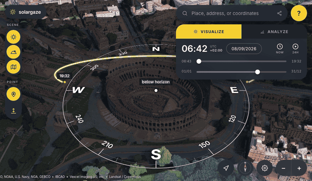

# SolarGaze

An open sun-and-shadow simulator that casts real shadows across **Google's
photorealistic 3D tiles** — the same mesh Google Earth renders. Pick a place,
drag two sliders (time of day, day of year) and watch the shadows move.

MIT licensed, no build step, no server. It is a folder of static files: push it
to GitHub Pages and it runs.

**Live: [fedepaj.github.io/solargaze](https://fedepaj.github.io/solargaze/)** —
it opens on the Colosseum. Forking? Point `REPO_URL` and `ION_CLIENT_ID` in
[`js/config.js`](js/config.js) at your own before you deploy.



<sub>Sunrise to sunset over the Colosseum, 8 September. The ring is a compass card
lying on the ground, the glowing arc is the sun's track for that day, and the beam
arrives from the sun's direction into the studied point. The app opens on this
view; for that exact instant and camera, append
<code>#ll=41.890468,12.492376&t=2026-09-08T13:12&cam=41.887135,12.492376,383&hp=360.0,-40.0</code>
to the URL.</sub>

## What it does

- **Google Photorealistic 3D Tiles** as the world, via Cesium ion — real
  buildings, real geometry, shadows cast by the actual mesh.
- **Two sliders**: time of day (spanning sunrise→sunset like a sun study, or a
  full 24 hours if you ask for it) and day of year, plus a date picker and a
  playback that sweeps the slider's span in about half a minute.
- **Sun path overlay**: a graduated compass card on the ground, the sun's arc
  for that day, sunrise/sunset markers, live azimuth and elevation readouts,
  and a line showing which way the shadow falls.
- **Correct local time**: the clock is the wall clock *at the place you are
  looking at*, DST included, resolved from the location's timezone.
- **Sun-hours probe** (ANALYZE tab): ray-casts against the loaded geometry to
  estimate hours of direct sun at the pin.
- Shareable links that restore the exact view, date and time.

Deliberately out of scope: drawing, placing objects, or editing the map.

## Driving it

### Keyboard

The map has focus by default; these are ignored while you are typing in a field.

| Key | Does |
| --- | --- |
| `←` `→` | Time, ∓10 minutes |
| `Shift` + `←` `→` | Time, ∓1 hour |
| `↑` `↓` | Date, ∓1 day |
| `Shift` + `↑` `↓` | Date, ∓30 days |
| `Space` | Start or stop the playback |
| `N` | Jump to the current local time at the pin |

### URL parameters

Everything after `#` is written back to the address bar as you move, so the URL
in the bar is always the link to what you are looking at.

| Parameter | Means |
| --- | --- |
| `#ll=lat,lon` | The studied point |
| `#t=YYYY-MM-DDThh:mm` | Date and time, as the **local** wall clock at that point |
| `#cam=lat,lon,height` | Camera position, height in metres |
| `#hp=heading,pitch` | Camera heading and pitch, in degrees |
| `?ion=TOKEN` | Save a Cesium ion token, then scrub it from the address bar |
| `?reset` | Forget everything this app stored and reload |

Combine the hash ones with `&`, exactly as the caption above the fold does.

## Getting the 3D mesh

The mesh is Google's Photorealistic 3D Tiles — the data Google Earth renders —
served through [Cesium ion](https://cesium.com/platform/cesium-ion/), which
brokers Google's credential. **Nobody using this needs a Google Cloud project or
a card on file.** All it takes is a free ion account.

### Sign in with Cesium ion (the good route)

Register the app once — ion → your username → *Developer Settings* → *Add
Application* — list every URL you serve from as a redirect URI, and put the
numeric client id in `ION_CLIENT_ID` in [`js/config.js`](js/config.js).

> **Forking?** `ION_CLIENT_ID` already holds the client id of the deployment at
> fedepaj.github.io, whose redirect URIs do not include yours. Sign-in on your
> fork will fail on ion's own page until you replace it with your application's
> id — or set it to `''`, which hides the button and leaves the paste-a-token
> route.

Visitors then get a **Sign in with Cesium ion** button. They approve once on
Cesium's own page and the tiles draw on *their* free quota — nothing to copy,
nothing of yours to spend. It is OAuth 2.0 authorization code flow with PKCE, so
there is no client secret and the token exchange happens in the browser: still
no backend, still fine on GitHub Pages.

> Redirect URIs are matched character for character. `http://localhost:5173/`
> and `http://127.0.0.1:5173/` are different entries — register whichever you
> actually browse to, trailing slash included.

Sign-in asks for two scopes: `assets:read` is the buildings, `geocode` is the
search box. If ion rejects the pair the app retries with `assets:read` alone, so
an older application registration still gets the mesh and search falls back to
OpenStreetMap — it says so when that happens, and *Settings* shows which of the
two you ended up with.

### Or paste a token

For forks with no registered application: sign up at
[ion](https://ion.cesium.com/signup), copy an access token from the *Access
Tokens* tab, and paste it in. `?ion=TOKEN` on the URL works too — it is saved
and scrubbed from the address bar immediately.

### Shipping a token so visitors need nothing at all

Set `DEMO_ION_TOKEN` in [`js/config.js`](js/config.js) and every visitor gets the
3D mesh with no interaction whatsoever. Before you do:

- **A token in a static site is public.** Whatever the browser can read, so can
  a reader of the page source. There is no way to hide it, so the goal is a
  small blast radius, not secrecy.
- Create a token **for this app alone**, with only the `assets:read` scope.
  Never publish your account's default token — those carry wider permissions.
- Every visitor's tiles are billed to **your** ion quota. When it runs out the
  app says so and drops to the flat basemap. *Settings → Mesh → Tile detail*
  trades sharpness for tiles fetched and is the biggest lever you have on that;
  the activity chip in the corner counts tiles this browser has pulled, which is
  a yardstick, not your balance — ion publishes no quota endpoint, so the real
  figure only exists on [ion's dashboard](https://ion.cesium.com/usage).

Sign-in is strictly better where you can register an application: each visitor
spends their own quota, not yours.

### Starting over

`?reset` on the URL — or *Settings → Reset* — forgets the sign-in, any pasted
token and every preference, then reloads.

### Without any of it

The app still runs: the full sun model and every control, over a plain
OpenStreetMap basemap. No 3D geometry, so no shadows. That is a fallback, not
the point.

## Deploy to GitHub Pages

```bash
git clone https://github.com/fedepaj/solargaze.git
cd solargaze
# in js/config.js: point REPO_URL at your fork, replace ION_CLIENT_ID with your
# own registered application (or set it to ''), and set DEFAULTS to the place
# you want the app to open on
git commit -am "Point at my fork"
git push
```

Then in **Settings → Pages**, either:

- set *Source* to **Deploy from a branch**, branch `main`, folder `/ (root)`; or
- set *Source* to **GitHub Actions** and let `.github/workflows/pages.yml` run.

Both work. There is nothing to build.

## Local development

```bash
npm run dev     # npx serve on http://localhost:5173
```

Any static server will do — `python3 -m http.server` works fine. The app must be
served over http(s), not opened as a `file://` URL, because it uses ES modules.
It needs a browser with WebGL: without it Cesium never starts, and no amount of
the rest of the app makes up for that.

CesiumJS comes from a CDN, pinned in [`index.html`](index.html) — the version
appears in three places there (the stylesheet, `CESIUM_BASE_URL` and the script
tag) and all three move together. `CESIUM_VERSION` in `js/config.js` is a
readable copy of that number for anything that wants to report it; editing it
alone changes nothing.

## How it is put together

```
index.html            overlay markup
css/app.css           the whole visual design
docs/                 the README's gif, plus the screenshots the in-app
                      Cesium-ion walkthrough loads at runtime — not dead weight
js/
  solar.js            NOAA solar equations — pure, dependency-free, testable
  timezone.js         IANA zone for a lat/lon, DST-correct wall-clock maths
  state.js            single source of truth + a small pub/sub bus
  scene.js            Cesium viewer, 3D tiles, shadow map, camera
  sunpath.js          the 3D overlay: compass card, day arc, readouts
  analyze.js          direct-sunlight-hours ray casting
  ion-auth.js         Cesium ion sign-in (OAuth2 + PKCE, no backend)
  app.js              bootstrap and wiring
  ui/                 timepanel (sliders, playback, keyboard), analyzepane,
                      search, compass, weather, usage meter, modals, toast,
                      tooltip
```

Two independent sun calculations run side by side and agree: CesiumJS derives
the light direction from `clock.currentTime` with its own ephemeris (that is
what the shadow map uses), while `solar.js` computes the numbers the interface
prints. Feed the clock the right UTC instant and both are correct.

`window.solargaze` exposes `state`, `viewer`, `setLocation` and `setPref` for
embedding or console tinkering.

## Accuracy

Sun geometry is good to well under a tenth of a degree, and rise/set times to
about half a minute. Spot-checked against Turin (45.0546, 7.6858), 19 Sep 2026:
geometric elevation 42.65° and azimuth 151.18° at 12:00 CEST, sunrise 07:12,
sunset 19:33. The readouts add atmospheric refraction, which lifts a sun at that
height by about two hundredths of a degree and one at the horizon by half a
degree.

The ANALYZE probe samples every **10 minutes** from sunrise to sunset, from a
sensor 1.5 m above the ground at the pin, so its answer is quantised to a sixth
of an hour — and it can only test tiles that are **currently loaded**, so zoom
in before trusting it.

What actually limits the result is the mesh. Google's tiles are photogrammetry:
trees, awnings, railings and thin structures are approximate, and the lighting
baked into the aerial imagery is not removed. This is a very good study, not a
survey.

## Licence and attribution

SolarGaze is MIT — see [LICENSE](LICENSE). The pieces it stands on are not
yours to relicense:

- **CesiumJS** — Apache-2.0.
- **Cesium ion** — how the tiles and the geocoder are reached; usage is governed
  by your ion plan and still subject to Google's terms below.
- **Google Photorealistic 3D Tiles** — governed by the
  [Google Maps Platform Terms](https://cloud.google.com/maps-platform/terms).
  Two obligations matter here: the on-screen attributions Cesium renders at the
  bottom of the map **must stay visible**, and while the tiles are displayed the
  search box must use **Google's geocoder**. With the mesh on screen the app
  routes search through ion's Google-backed geocoder; on the flat basemap, where
  no Google data is shown, it uses Nominatim. If ion refuses a geocode — a
  sign-in without the `geocode` scope, or an exhausted quota — the box degrades
  to Nominatim and says so on screen rather than going dead. If that trade is
  not one you want to make on your deployment, it is the one thing in
  [`js/ui/search.js`](js/ui/search.js) to change.
- **OpenStreetMap** (fallback basemap) — ODbL, © OpenStreetMap contributors.
- **Open-Meteo** (weather badge) — CC-BY 4.0.
- **tz-lookup** — timezone boundary data, CC0.

Not affiliated with, or endorsed by, Google or Shadowmap.
